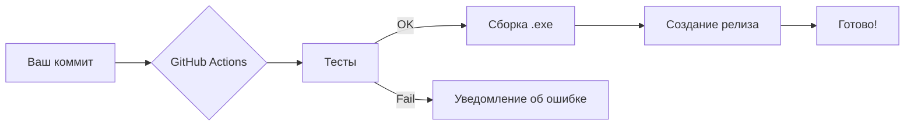

# 🤖 Автопилот GitHub Actions

Этот проект настроен на **полную автоматизацию** через GitHub Actions. Вам нужно только делать коммиты в ветку `main` — остальное система сделает сама.

## 📋 Что работает автоматически

### 1. CI/CD Пайплайн (`ci.yml`)
При каждом пуше в ветку `main`:
- ✅ **Тестирование**: Запускаются все тесты через `pytest`
- ✅ **Сборка**: Компилируется `.exe` файл через PyInstaller
- ✅ **Авто-Релиз**: Создаётся новый релиз с бинарником на GitHub
- ✅ **Версионирование**: Теги создаются автоматически в формате `vГГГГ.ММ.ДД.номер_сборки`

### 2. Авто-Обработка Issues (`auto-triage.yml`)
При создании нового Issue:
- 🏷️ **Авто-лейблы**: Расставляются метки (`bug`, `enhancement`, `question`) по ключевым словам
- 💬 **Авто-ответ**: Отправляется приветственное сообщение автору

### 3. Релизы (`auto-release-notes.yml`)
После публикации релиза:
- 📝 Фиксируется информация о версии и дате выхода

---

## 🚀 Как пользоваться

### Ваш рабочий процесс:
1. Вносите изменения в код
2. Делаете коммит: `git commit -m "Описание изменений"`
3. Пушите в main: `git push origin main`

### Всё остальное делает GitHub:


---

## ⚙️ Настройки

### Секреты (Secrets)
Для работы автопилота убедитесь, что в репозитории настроены секреты:
- `GITHUB_TOKEN` — создаётся автоматически GitHub
- *(Опционально)* Вебхуки для уведомлений в Telegram/Discord

### Лейблы
Создайте в репозитории следующие лейблы для работы авто-триажа:
- `bug` — для сообщений об ошибках
- `enhancement` — для предложений новых функций
- `question` — для вопросов

---

## 📦 Структура workflows

```
.github/workflows/
├── ci.yml                  # Основной пайплайн: тесты → сборка → релиз
├── auto-triage.yml         # Авто-обработка новых Issues
└── auto-release-notes.yml  # Обработка событий релизов
```

---

## 🔧 Расширение функционала

Вы можете добавить новые возможности:
- Уведомления в Telegram/Discord при успешном релизе
- Автоматическую загрузку на сторонние хостинги
- Деплой на сервер при обновлении документации
- Авточистка старых артефактов

---

*Автопилот активирован. Просто делайте коммиты! ✨*
